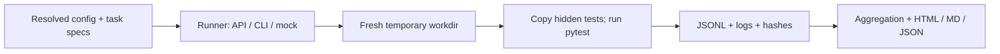

# agent-eval-harness

Comparing coding models by reading a few plausible answers is difficult to reproduce and easy to
misjudge. This CLI and typed Python library run the same small task through several models or
coding-agent commands, grade the produced files against withheld pytest tests, and preserve the
evidence behind each result. It is built around verification and validation: explicit contracts,
boundary tests, repeatable execution, and honest accounting of missing measurements.

## Features

- Python 3.11+; strict typed library and an `argparse` CLI.
- OpenAI-compatible Chat Completions and Anthropic Messages over `httpx`; no vendor SDKs.
- Generic external CLI runner and deterministic offline fixtures.
- Fresh workdirs, tests copied after generation, subprocess timeouts, and XML result parsing.
- Bounded attempt concurrency and repeated model × task trials.
- Versioned JSONL, task hashes, resolved config, raw outputs, generated source, and test logs.
- Pass@1, unbiased pass@k, mean/median wall time, and reported tokens and costs.
- Markdown, JSON, and self-contained HTML with a pass matrix and inline SVG timing bars.
- Six task families: TTL-aware LRU cache, interval merging, arithmetic parsing, sliding-window
  rate limiting, Roman numeral round-trips, and a JSON-path-lite getter.

## Architecture



The runner sees the prompt and target filename. The harness owns grading and records every
completed attempt, including failed generations. Temporary workdirs are deleted after artifacts
are saved. Time waiting for a concurrency slot is excluded from attempt timing.

## Quickstart

From a checkout, install the package and grading dependency:

```sh
python3 -m venv .venv
. .venv/bin/activate
python -m pip install -e '.[grade]'
```

Run the offline demo in one command:

```sh
agent-eval run examples/mock-demo.yaml
```

The command prints the path to `runs/<timestamp>/report.html`. Open that file in a browser.
This demo compares reference fixtures with deliberately wrong fixtures; it measures the harness,
not any model's capabilities. It needs no credentials or model network access.

To choose the run directory and render other report formats:

```sh
agent-eval run examples/mock-demo.yaml --out runs/my-demo
agent-eval report runs/my-demo/results.jsonl --format md --out runs/my-demo/report.md
agent-eval report runs/my-demo/results.jsonl --format json --k 2
agent-eval list-tasks
agent-eval validate-task tasks/lru_ttl/task.yaml
```

Output directories must be new; runs never overwrite existing evidence. A completed evaluation
exits 0 even if attempts fail. `validate-task` exits 1 for a failing reference, input/usage errors
exit 2, and interruption exits 130. Completed JSONL lines remain usable after interruption.

For development, `make install` installs `.[dev]`, including pytest, coverage, linting, typing,
and build tools. The four library dependencies are pydantic v2, PyYAML, httpx, and jinja2.
The `grade` extra installs pytest; report-only installations can use `pip install .`.
Example tasks and configs live in the source checkout, rather than the installed wheel.

### Real model endpoints

Edit the placeholder model identifiers in `examples/real-models.yaml`. Supply endpoint base URLs
and keys through the environment; each base URL must include the service's API version path.
The adapters append `/chat/completions` or `/messages` respectively.

```sh
export COMPATIBLE_BASE_URL='<compatible endpoint base URL including version path>'
export MESSAGES_BASE_URL='<messages endpoint base URL including version path>'
read -r -s -p 'Compatible API key: ' COMPATIBLE_API_KEY; echo
read -r -s -p 'Messages API key: ' MESSAGES_API_KEY; echo
export COMPATIBLE_API_KEY MESSAGES_API_KEY
agent-eval run examples/real-models.yaml --out runs/real-comparison
```

The key prompts above use bash. Live evaluations may incur charges. Nothing in the demo or test
suite calls a live model. Keys are read at request time; known configured key values are redacted
from saved artifacts. API failures omit response bodies, headers, and URLs. Put only environment
variable names in config, never literal keys in prompts, commands, or options.

## Config reference

Task globs resolve relative to the **config file**, not the shell's working directory. Every glob
must match, duplicate file matches are deduplicated, and task ids and model names must be unique.
Unknown config fields and built-in runner options are rejected.

```yaml
models:
  - name: local-reference
    runner: mock
    options:
      variant: reference
tasks:
  - ../tasks/*/task.yaml
repeats: 2
concurrency: 2
```

| Field | Meaning |
| --- | --- |
| `models` | Nonempty list of `name`, registered `runner`, and runner-specific `options` |
| `tasks` | Nonempty list of task YAML globs; recursive `**` is supported |
| `repeats` | Positive integer; attempts per model × task; default 1 |
| `concurrency` | Positive integer; maximum active generation-plus-grading attempts; default 1 |

| Runner | Options |
| --- | --- |
| `openai` | Required `model`, `base_url_env`, `api_key_env`; optional `max_tokens` (4096), `timeout_s` (120), `temperature` (omitted by default) |
| `anthropic` | Same fields; Messages API with version header `2023-06-01` |
| `cli` | Required `command` (argv list or shell-like string); optional `timeout_s` (120) |
| `mock` | `variant`: `reference` (default) or `wrong`; optional `fixtures`: task-id → task-relative Python file |

API requests are non-streaming and have a total wall-clock deadline. Compatible services must
support the Chat Completions fields
used here, including `max_tokens`. A response can report `usage.cost_usd`; otherwise cost stays
unknown. Neither standard adapter invents cost from token counts. Unreported tokens also stay
unknown, and report totals show how many attempts supplied each measurement.

CLI arguments support `{prompt_file}`, `{workdir}`, and `{entrypoint}` placeholders. Prefer an
argv list to avoid quoting ambiguity. No shell is launched; pipes, redirection, and environment
assignments are not interpreted. Escape literal braces as `{{` and `}}`. For example:

```yaml
models:
  - name: external-agent
    runner: cli
    options:
      command: [agent-command, --prompt-file, '{prompt_file}', --output, '{entrypoint}']
      timeout_s: 180
tasks: [../tasks/*/task.yaml]
```

Replace `agent-command` and flags with those supported by your installed tool. The command runs
inside the fresh workdir and must write the entrypoint itself; stdout is saved, not treated as code.
The prompt file contains the task instructions. CLI tools inherit the parent environment for
authentication; grader processes receive only a minimal environment without API credentials.

## Writing a task

Create a directory with `task.yaml`, `reference.py`, and one or more pytest files:

```yaml
id: answer
title: Return an answer
prompt: Implement answer() returning the integer 42.
language: python
entrypoint: solution.py
hidden_tests: [hidden_tests.py]
reference: reference.py
timeout_s: 5
tags: [intro, functions]
```

`reference` defaults to `reference.py`, `language` to `python`, `timeout_s` to 10, and `tags` to `[]`.
Entrypoints must be plain Python module filenames. Test and reference paths must stay inside the
task directory, including after resolving symlinks. References are required for validation and the
default mock fixture; real model evaluations need only the spec and tests.

The reference exports the API specified by the prompt:

```python
def answer() -> int:
    return 42
```

The hidden test imports the generated entrypoint:

```python
from solution import answer


def test_answer() -> None:
    assert answer() == 42
```

Run `agent-eval validate-task path/to/task.yaml`, then add the spec to a run config. Test files
must be self-contained: only the listed files are copied, under unique test filenames. Shared
`conftest.py`, auxiliary assets, and third-party pytest plugins are not loaded. Example solutions
need only the standard library. Specify all expected error types and boundary semantics in the
prompt; hidden tests should assess that contract rather than surprise requirements.

## Results and interpretation

Each run contains:

```text
config.resolved.yaml
metadata.json                 # harness/Python versions, platform, timestamp, SHA-256 hashes
results.jsonl                 # one schema_version="1.0" object per completed attempt
summary.json
report.html
attempts/attempt-000001/
    model-output.txt          # returned text or combined CLI stdout/stderr; key-redacted
    solution.py               # generated entrypoint, when present; key-redacted
    test.log                  # combined pytest stdout/stderr
```

Metadata hashes the source config, task specs, hidden files, available references, and selected
custom mock fixtures. Each
attempt records model/runner/task, repeat, outcome, passed/total tests, wall/generation/grading
time in seconds, nullable token counts and USD cost, error category, and artifact location.
JSONL is written and flushed in completion order; ids reflect deterministic scheduling order.
Hashing records provenance, not a guarantee that a remote service will reproduce an answer.

| Outcome | Meaning |
| --- | --- |
| `pass` | pytest exits 0; at least one test ran; every reported case passed |
| `fail` | Test failures, or skipped cases that prevent complete verification |
| `error` | Generation failure, missing source, collection/setup error, invalid XML, or pytest infrastructure failure |
| `timeout` | Generation or grading exceeded its own timeout; no completed test counts are claimed |

`tests_total` counts XML test cases, including skipped cases and collection errors; it is not the
number of assertions. A collection failure may prevent the full intended test suite from running.
Unexpected failures remain in the denominator. Reports average task pass rates equally; when
task sets differ between models, the matrix exposes that difference and scores need care.

For n attempts with c successes on one task, pass@k is:

```text
1 - C(n-c, k) / C(n, k), for 1 <= k <= n
```

Task estimates are averaged equally. Default reports include k in 1, 2, 5, 10 only where all
observed tasks for a model have enough attempts; use repeated `--k` flags for other choices.
Pass@1 is c/n, averaged over tasks, rather than the outcome of an arbitrarily selected first trial.
The unbiased interpretation assumes independent, identically distributed samples for each task.
Deterministic fixtures and correlated agent sessions do not establish that assumption. Reports
describe observed samples; they do not provide confidence intervals or broad capability claims.

## Library and extensions

```python
import asyncio
from pathlib import Path
from agent_eval.engine import run_config
from agent_eval.results import summarize
from agent_eval.report import render_report

attempts = asyncio.run(run_config(Path("examples/mock-demo.yaml"), Path("runs/library-demo")))
markdown = render_report(summarize(attempts), "md")
```

`agent_eval.runners.base.Runner` is a protocol with asynchronous
`generate(task: TaskSpec, workdir: Path) -> Generation`. Register a factory with
`register_runner(name, factory)` before `run_config`; its signature is
`factory(options: dict[str, Any], *, task_path: Path) -> Runner`. Factories validate their own
options. Runners write files, return raw output and optional usage, and raise `RunnerError` for
sanitized generation errors. A custom runner must enforce its generation deadline and cooperate
with cancellation. Registration is process-local; the CLI includes the four built-in runners.

## Design decisions

- **Withhold tests until generation ends.** This avoids putting answers or assertions directly
  in the agent workspace while it solves the task. It reduces accidental leakage, but is not
  adversarial access control: the source checkout remains accessible on the host.
- **Use the unbiased pass@k estimator.** Counting whether any observed attempt passed mixes
  different sample sizes. The combinatorial estimator uses all samples without pretending
  that unsupported k values can be estimated.
- **Use subprocess isolation.** Separate interpreters avoid module-cache and global-state
  contamination between attempts. On POSIX, timeouts and cancellations kill process groups.
  This provides operational separation, not containment of hostile Python code.
- **Avoid vendor SDKs.** Small HTTP adapters expose the payloads under test, keep dependencies
  small, and allow full offline protocol tests with `httpx.MockTransport`.
- **Keep missing measurements explicit.** No guessed token usage, pricing, or model scores.
  Time includes grading overhead; parallel runs share resources and are not pure model latency tests.

## Security: untrusted model code

Tests execute model-produced Python with the permissions of the harness user. A temporary
directory and a subprocess are **not a security sandbox**. Code can access host files and the
network, consume resources, or tamper with grading. CLI agents can also read files outside their
workdir. Do not run untrusted generations directly on a sensitive host.

Use Docker on a disposable machine, avoid sensitive bind mounts, and restrict resources/network
access as appropriate. The supplied image runs as a non-root user. For the offline demo:

```sh
docker build -t agent-eval-harness .
docker run --rm --network none --memory 512m --cpus 2 --pids-limit 128 \
  --read-only --tmpfs /tmp:rw,nosuid,nodev,size=256m \
  agent-eval-harness run examples/mock-demo.yaml --out /tmp/demo
```

That disposable run removes its report when the container exits. To retrieve a report without a
host bind mount, use a named container with its writable output directory instead:

```sh
docker create --name eval-demo --network none --memory 512m --cpus 2 --pids-limit 128 \
  agent-eval-harness run examples/mock-demo.yaml --out runs/demo
docker start -a eval-demo
docker cp eval-demo:/app/runs/demo ./container-demo
docker rm eval-demo
```

Real API generation requires network access. This image runs the whole harness in one container
and does not isolate generation from grading. Tests are public fixtures withheld from the attempt
directory, not secret benchmark material. Saved source and logs can contain sensitive prompt data;
review them before sharing. Literal configured API-key redaction is a precaution, not a general
secret detector.

## Sample output

<!-- SAMPLE_OUTPUT -->

Placeholder: insert output from a real run here. No model benchmark claims are included.

## Limitations

- Python tasks only, designed as small standalone modules, with no dependency installation.
- Public fixtures may be memorized; only specified behavior is tested, not code quality or general ability.
- No container per attempt, memory/output-size limits, filesystem jail, or network isolation.
- POSIX process-group cleanup is stronger than the direct-child cleanup available on other platforms.
- No automatic retries or rate-limit backoff; errors remain visible as attempts.
- No run resume, service-side seed guarantee, streaming responses, or built-in agent sessions.
- Only the entrypoint is archived from a CLI workdir; additional generated files are not retained.
- Results may vary with package versions and concurrent machine load; dependency bounds are not a lockfile.
- Cost totals rely on an explicitly returned `usage.cost_usd`; most endpoints omit it.

## Roadmap

- Multi-language task execution.
- Docker-per-attempt sandboxing with resource and network controls.
- SWE-style repository tasks and patch-based artifacts.
- Broader cost tracking with explicit pricing provenance and reported-versus-estimated labeling.

## Development

```sh
make install
make lint typecheck test
make demo
```

CI is configured for Python 3.11 and 3.12, checks coverage at 85% or higher, builds the package and
Docker image, and uploads an offline HTML demo report. This describes the committed workflow;
it is not a claim that a hosted CI run has occurred. See [CONTRIBUTING.md](CONTRIBUTING.md).
Distributed under the [MIT license](LICENSE).
